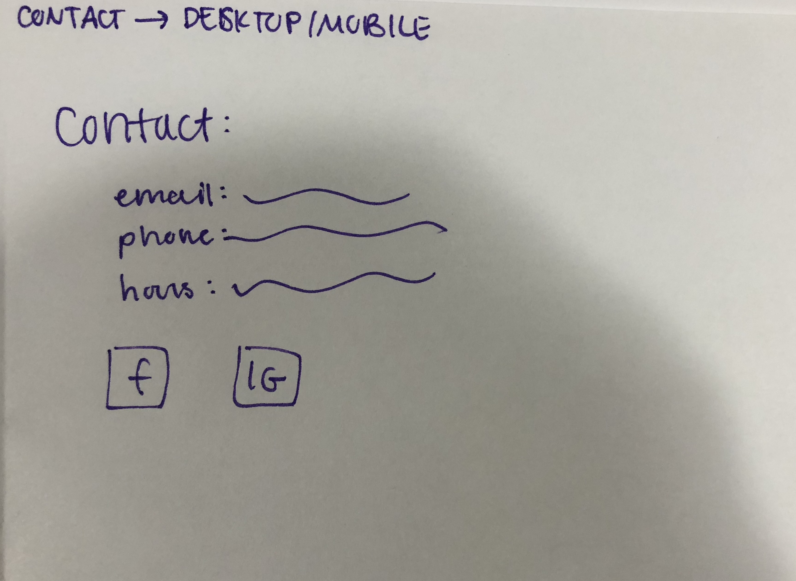

# Project 4 - Design & Plan

Be clear and concise in your writing. Bullets points are acceptable.


# Planning

## Client Description (Milestone 1)
> Tell us about your client. Who is your client? What kind of website do they want? What are their key goals?

Our client, Level B Bar, Lounge, & Dancing, is a popular bar in the Collegetown area of Ithaca. Their current website features basic information like their hours, history of the bar, drinks, reservation/private booking information, and contact information. They want their website to keep the majority of the content, the logo and blue theme, and lots of images; other than that, though, they just want a more up-to-date, visually appealing, functional site that will increase publicity and ease of access to bar information.

> NOTE: **If you are redesigning an existing website, give us the current URL and some screenshots of the current site.** Tell us how you plan to update the site in a significant way that meets the Project 4 requirements.

URL: http://www.levelbbar.com/


Screenshots of some of the current site's important pages are provided above. We plan to spread out the content, making it easier to follow, more visually appealing, and eliminating much of the empty space on the current site. We plan to combine the Reservation and Contact pages into an interactive form with which users can schedule events and send their info to the client. The Gallery page will be eliminated and images will be distributed by page and formatted among the other content. Our new site will prioritize what the bulk of users want to see: bar times, promotions, drinks, and event booking. To draw users, the new site will have a modern, attractive interface with easy usability.


## Site's Purpose (Milestone 1)
> Tell us the purpose of the website and what it is all about.

The site's purpose is to advertise the bar, its information, and its promotions as well as special events. The client also wants the site to not only give information for contacting them, but include an interactive way to do it directly on the site as well. This bar is already popular amongst the Cornell/Ithaca community, and promotions/news spread quickly across campus through word of mouth. Ultimately, the major goal of the improved site is to increase Level B publicity and drive customer growth for the bar.


## Client Meeting Notes (Milestone 1)
> Include your notes/minutes from the client meeting, an email they sent you, or whatever you used to keep track of what was discussed at the meeting.


## Client Needs and Wants (Milestone 1)
> Collect your client's needs and wants for the website. Come up with several appropriate design ideas on how those needs may be met. In the **Memo** field, justify your ideas and add any additional comments you have. There is no specific number of needs required for this, but you need enough to do the job.

Needs/Wants: Modernize site while keeping content, logo, and theme
- **Needs and Wants** [What does your client need and want?]
  - The client wants an entirely new, modernized design. However, a requirement for this design is that it keeps the logo, theme, and much of the general content from the current site (although we can change the specific wording/format of the content).
- **Design Ideas and Choices** [How will you meet those needs and wants?]
  - We will accomplish this by centering the site's theme around the logo and a blue color scheme. Leaving the background the current color, while changing fonts, borders, and features to other shades of blue that complement the background well, will give the site an appealing, slick look.
- **Memo** [Justify your decisions; additional notes.]
  - The color and theme is very important when designing this site. As users are primarily younger, they want a visually appealing color scheme that isn't too dull, but also isn't too straining on the eye. The client specified that the color blue and other thematic elements are important to their brand and must be incorporated into the design.

Needs/Wants: Site content is based on promotions
- **Needs and Wants** [What does your client need and want?]
  - The client needs their nightly events and promotions (e.g. Fishbowl Wednesday) to be prioritized on the site, and they want this to be done by dynamically changing content based on the day of the week.
- **Design Ideas and Choices** [How will you meet those needs and wants?]
  - We will have a whole page dedicated to drinks, events, and promotions. We also plan on having the site's content change according to the day of the week, indicating to the user right when they visit the site what event is going on that night.
- **Memo** [Justify your decisions; additional notes.]
  - Changing the font/colors for each displayed promotion will make the site different each time a user visits it. A new, big message at the top of the screen will definitely catch users' eyes.

Needs/Wants: Event booking form
- **Needs and Wants** [What does your client need and want?]
  - The client needs a more convenient, functional way for users to contact them for booking bar tabs or other events. Currently, the owner sends a form via email to the customer and endures the ensuing email chain in order to determine event specifications. The client wants the user to be able to give their name, information, and event details all while on the site.

  This is form the client currently uses to book events:


- **Design Ideas and Choices** [How will you meet those needs and wants?]
  - To account for this, we plan to make an event booking form on which users can give their email and specify the date, time, and price of the event they want to have. The client will receive all this information when the user submits the form, so that they can contact them directly to confirm the event.
- **Memo** [Justify your decisions; additional notes.]
  - Adding this interactivity is likely to increase site traffic as well. Currently, most people call the client to book events. We believe this is due to the outdated site with low usability. Implementing this form adds a new reason for users to visit the site, especially since most of the bar's other information on the site is widely known already.

Needs/Wants: Many images
- **Needs and Wants** [What does your client need and want?]
  - The client wants the site to contain lots of images, preferably ones that look clear and new, to draw users' attention and advertise the bar and its drinks.
- **Design Ideas and Choices** [How will you meet those needs and wants?]
  - We will collect images from the current site and the bar's social media collection, as well as taking some ourselves if needed, and distribute them across the site's pages according to content. In particular, we want to emphasize the venue, the drinks, and what a night in the bar looks like with our images.
- **Memo** [Justify your decisions; additional notes.]
  - Images must be organized appropriately by the content of the image and surrounding content. Images placed randomly with no specific relation to the content around them are not helpful in reaching the client's goals for the site.


## User(s) (Milestone 1)
The users of the website that we plan to design are organizations (Greek life, clubs, professional, etc) in Ithaca interested in holding social events at clubs and bars. Specifically, we want to target the people in the leadership roles in these organizations as they are the ones mostly organizing such events.  Instead of making the website to market the night club to the public, our client wanted it to be targeted towards organizations that could potentially reach out for reservations. These users should be able to get a good feeling of the environment in Level-B and easily proceed with the reservation process through our website.

## Discovering Users' Needs (Milestone 1)
> You'll need to discover your users' needs. Talk to them! Document what you've learned about them. When talking to your users, take notes and include those notes here.


## Users' Needs (Milestone 1)
> Analyze the users' needs and wants from your notes above. List each need/want below. There is no specific number of needs required for this, but you need enough to do the job.
> **Note:** These are probably *not* the needs of your client.

Need/Want: Faster reservation
- **Needs and Wants** [What do the users need and want?]
  - A faster process of reserving the venues for the events that they want to hold. This will make them more willing to opt for options that have an easier reservation process
- **Design Ideas and Choices** [How will you meet those needs and wants?]
  - One of the things that could be added is the booking form (as also suggested by the client). This will make it easier for users to get their booking rather than do the process on paper. Other than that what we can add to the website is a schedule for the times that are available for Level-B to be reserved
- **Rationale & Additional Notes** [Justify your decisions; additional notes.]
  - In order to find the middle ground between our client's demands and our users demands, we need to make sure that we provide something that satisfies both. The booking reservation would not only help the client, but also help the user to get a faster reservation process. The additional schedule may also help them plan their reservation better by finding it on the website rather than contacting the owner of the venue.

Need/Want: Highlighted prices and space available
- **Needs and Wants** [What do the users need and want?]
  - The clients want more information about the venue before they consider reserving it. One of the considerations that they raised was the price and space of the venue. Looking at the current website of Level-B, we can see that this is not really highlighted well.
- **Design Ideas and Choices** [How will you meet those needs and wants?]
  - Reorganizing the information to one of the main pages (probably around the general information about Level-B) would really help the users find what they are looking for. Another idea that could be possible is maybe a blueprint of the space sketched out that could be downloaded. This will help the user better visualize the spacing.
- **Rationale & Additional Notes** [Justify your decisions; additional notes.]
  - The design ideas proposed have yet to be tested out. These are quite ambitious ideas that may or may not work and user testing would lead us to the right decision. However, talking to the users and listening to their need of proper information brought us to the decision to reorganize and add additional information to the website.

Need/Want: Environment (Better Idea)
- **Needs and Wants** [What do the users need and want?]
  - Another concern raised by the users was to get a proper idea of the environment that would be found at the venue. They usually find the pictures to be either too bad in quality or very well edited that does not portray the actual environment of the venue.
- **Design Ideas and Choices** [How will you meet those needs and wants?]
  - To tackle this demand of the user, we would need more content then there already is on the current website. By taking more pictures of the club that show the actual environment to be found in Level-B would give the users what they want. Other than pictures, we might also add a section for reviews that future users could look at for more feedback.
- **Rationale & Additional Notes** [Justify your decisions; additional notes.]
  - The current website fell in the category of not highlighting the environment of the club as well as it actually is. New and recent images would help the users to get more a feeling of what they can expect. They can always visit the venue to do so, but we are looking to make it more convenient for both the user and the client and streamline the process from "looking for a reservation" to actually holding the event.

## User Testing Plan (Milestone 1)
> Plan out your tasks for evaluating whether your site will meet the needs of the users. These must be actual user testing tasks. Tasks are not questions!

1. Reserve a $500 bar tab for 100 people.

2. Find the drink special for Tuesday nights

3. Determine the club hours for Friday nights

4. Contact the owner about an over/under party.


## Content (Milestone 1)
> Plan out your site's content (text, images, etc.). Make a list of **all** the content you will need. This list should be **exhaustive**.

- Welcome Statement
- About
- Hours
- Upcoming Events
- History of Level B
- Social Media Pages
- Weekly Specials Drink Menu
- Cocktails + Beer Menu
- Interactive Event Registration form
- Description of event offerings
- Level B Contact Info
- Level B Address
- Kam’s (Owner) Info
- Staff Bios
- Admissions Requirements
- Job Openings
- Photos of Drinks
- Photos of Bar
- Photos of Event space
- Staff photos

Images:
Weekly special promotion images: 5
Header Image for Home pages: 1
Drink special images for Drinks page: 3
General photos of bar/view from outside: 3

We are coordinating with our client to get more images for the site: the available images are outdated and low quality and, as such, we have requested better ones. Additionally, the client is planning on providing marketing materials and other special images to use on the site.


## Interactivity Ideas (Milestone 1)
- Booking Form used by owner to make reservations on the website

- Dynamically changing content according to daily drink specials

- Content according to event and drinks

- Review submission form


# Design & Evaluation

## Design Process (Milestone 1)
> Document your design process. Show us your card sorting. Design your navigation from the card sorting. Outline your navigation. Describe your theme. Show us sketches of your site (mobile and desktop versions). etc.
> You should show us how your came up with your design and how your iterated on that design; show us the evolution of your design.

> **Note:** Card sorting is used to organize your site's content. For each piece of content identified in the previous section, write a summary of that content onto a card. Now sort the cards. The grouping of cards provides you with your pages for your website. **Do not write down the pages you want and then "card sort" those. That is not card sorting.**


### Card Sorting Process


First, I wrote all the above content items on cards. It seemed clear what fell under the "Drinks" "Events" and "Employment" categories. However, there were hazy distinctions between the "Home" and "About" pages, specifically with regard to the most relevant information (such as contact info, hours, social media pages). These were all "about" Level B, but it felt like they should be under the Home page, because that's the information the target audience would be most likely coming to the website for.


After further consideration, I realized that the target audience is unlikely to want to be interest in the staff bios or photos, so I took that contact out.

Then, I decided to divide the content 'groups' into two navigation bars, the header and the footer. However, I still wanted to make the address, hours, and contact information easily accessible on the first landing page. I managed to balance these two needs by having a footer section, and then having that information directly readable on the footer section (it would list out the hours, the address, and link the social media).

The separation of the footer and header navigations also serve to tailor to different audiences. There are only certain users who would be interested in regulations and job openings - these are very niche pages, so it makes sense to put them in the footer. Anyone who is looking for these pages is likely to scroll to the bottom for this, as it is becoming a norm (and almost an expectation) for the employment and legal information of companies to be in the footer section of their website.

Then, the header navigation makes sense, once everything else is sorted away. These three (four, including the home page), provide the information that users are most likely to be interested in, and the division of content between the pages is clear.


This is my final sort, with how the header and footer navigation will divide up the content.

### Card Sort Results:

    Header Navigation:

        1. Home
            1. Photo of bar
            2. Upcoming Events
            3. Today's Special
            4. About
        2. History
            1. Photos of bar
            2. Photos of owner
            3. About the owner
            4. History
        3. Drinks
            1. Today's Special
            2. Weekly Specials
            3. Cocktail Menu
        4. Events
            1. Photos of Events
            2. Types of Events
            3. Event Registration Form

    Footer Navigation:

        1. Address
        2. Hours
        3. Contact
            1. Contact page:
                1. email
                2. phone
                3. Hours
                4. social Media
        4. Jobs
            1. Open position descriptions
            2. How to apply
        5. Regulations
            1. Description of regulations

### Theme
The theme of this website should be modern and BLUE (one of the few requests from the owner). The website should use modern, sleek fonts, to tailor to the college student audience. There should be a club or night-life sense to the website. Colors include blue, purple, a little neon, and black. The fonts should be primarily sans-serif, something that looks clean and contemporary. The overall vibe of the website should be "cool"; it should make students want to host events there, to go out drinking there, through looking fun, modern, and exciting.

### Main Pages Sketch & Summary
#### HOME PAGE

Desktop:

I chose to place Upcoming Events and Today's Special side by side because those are the things we want to make sure the target audience knows; they are also the most exciting. The goal is to pull the users into Level B or to want them to go drink or host an event there. By having one of the first things they see be an exciting drink special or upcoming event, this ensures the most critical information is visible to the potential customer.

I put the About section below it because users may not be as excited to read the "About" section, but it should still be on the home page as a sort of welcome or debriefing of what Level B is. If someone is interested, they can easily scroll a little and read it, however, if someone is looking for drinks or events, then they get the most valuable information on the Home site first (upcoming events, today's specials).

Mobile:

It makes sense to slot Today's special underneath Upcoming events, to organize the sections in a column rather than row because the mobile design is conducive to scrolling top down, not left right.

#### HISTORY

Desktop:

History is probably going to be a larger section, and take up more space than the "about the owner", so I moved History to the right, so that that section would span the same length as the photos and the owner info put together. I think the photos also add a natural division between the information.

Mobile:

Same as before, I arranged the sections into columns. I reconfigured the photos into a row to create visible break in the two sections.  

#### DRINKS

Desktop:

Again, we want to excite the target audience. Thus, I put the Today's special on the left side, so it is the first thing they see. Then, I added the weekly menu and cocktail to the right in columns. This is because desktop is best for left to right readings, and the user's eyes will naturally skirt from left to right when reading the headings. This will help them quickly find what they're looking for.

Mobile:

Slotted the sections into one column.

#### EVENTS

Desktop:

I wanted to make sure that the Registration form was very visible. Thus, I put it on the right side. I decided to put it on the right side because it made sense to have the text content on the left side, as that will be the first thing the users see. They should read the event types first, before registering, so that they can educate themselves on the different choices they have, and use that information to inform how they fill out the form. I included photos up top because users (especially in the college student audience) are most intrigued by photos, and we could use these to further draw them into reading about the events offerings. Once they get excited about the events, then they are more likely to fill out the form, and thus become a paying customer.

Mobile:

One potential change is to move the photos in between the form and the event descriptions. The reason I chose against it is because I don't want the user to give up on filling out the form. The most important thing is for them to find the form first, which is why it's at top. Then, if they are confused, then they can scroll down and find the descriptions. This should answer their questions, so they don't get frustrated and give up. If they still want to see what the events look like, then they can scroll down even more and see the photos. I believe the current alignment makes the most sense in terms of the safest ways of securing event registrations by providing the most important information first.


### Footer Pages Sketch & Summary
#### FOOTER
As you will have seen at the bottom of my sketches, we have included a footer navigation bar. The footer will first have the Level B name, and underneath it little icons that link to social media pages. The target audience (college kids) are big social media users, and following a company on social media increases the intimacy between customer and company. Thus, if a college student follows Level B on Instagram, they will feel more attached to it and are more likely to go. Thus, this information should be visible on every page to increase it's noticeability, and putting it on the footer bar is a way of doing this. Other information that should be on every page because it is critical in ensuring that people are able to go to Level B are the Address and the Hours. Instead of making this on a separate page (or a button on the footer that links to a separate page), we will write this information directly on the footer bar. This way the user doesn't have to click on anything or do any extra work; all the information they need to connect with Level B, to find Level B, to visit Level B during working hours, they just need to scroll down to find, regardless of their page.

Then, the footer bar has links to the "Contact" page, the "Jobs" page, and the "Regulations" page. One possible change is to move the "Contact" section to the "History" page or the "About" page. The primary and current reasons for these three pages to be in the footer is because they link to pages that serve very niche audiences. I will elaborate on each page below.

#### CONTACT

This contact page has important information regarding contact methods for Level B. One option is to remove the button that links to this page in the footer, and instead replace the button with a text box that has this information directly visible in the footer.

#### JOBS

This page is very niche. It has the Job Openings at Level B, and information on how to apply. It makes sense to have the job openings first, because people will only need to know how to apply if they are first interested in any of the opening jobs. If they do see a job they want to apply to, then they'll scroll down and find that information.

I don't think different Desktop and Mobile designs are necessary. If anything, we could move the "To apply" section to the right on the desktop page, but I truly doubt it's necessary because there is not an obscene amount of information, and such organization is not needed.  

Also, this page will have the header/footer navigation, I just did not draw it in.

#### REGULATIONS

This page will have a paragraph on the admission rules and regulations, or other legal information. This will just be a simple paragraph. The main reason for this page is for those looking for this exact information (which probably isn't the target audience of college students). Thus, we don't really need to worry as much about "exciting" or "pulling in" the users. We just need to have the content there.

Again, since it's just a paragraph of text, no mobile responsiveness is needed.

Also, this page will have the header/footer navigation, I just did not draw it in.


## Interactivity (Milestone 1)
- After meeting with our client, we proposed the idea of changing content according to the day of the week. The client loved the idea as the Level-B has a lot of events and promotions. Therefore, we plan to add a separate webpage dedicated to drinks, events, and promotions. This webpage would change according to the specific event hosted by Level-B on that particular day e.g. Fishbowl Wednesday. This would make the website more dynamic and draw users to visit the website more often to know if there is anything special they could expect at the club. The changes would be focused on the specific events and promotions provided by our client and will highlight the theme of the event by changing the theme of the page itself!

- Another key part of the interactivity that we plan to introduce to the website is the Event Booking Form. The client has been forwarding this form to people interested in making reservations at Level-B. Adding this form to the website would streamline the process of making a reservation putting both the client and the user at ease. It will also prompt more reservations as the process would seem a lot simpler and open to all users. The users can share their required information to the client and the client can make arrangements accordingly and confirm the reservation. Of course, we would include custom feedback messages on this form catered to the target audience and design it to complement the overall theme of the website.

## User Testing (_optional_)
> This testing is optional.

### User 1 - Testing Notes (Milestone 1)
> When conducting user testing, you should take notes during the test. Place your notes here.


### User 1 (Milestone 1)
> Using your notes from above, describe your user by answering the questions below.

1. Who is your user, e.g., where does the user come from, what is the user's job, characteristics, etc.?


2. Does the user belong to your target audience of the site? (Yes / No)
> If “No”, what’s your strategy of associating the user test results to your target audience’s needs and wants? How can your re-design choices based on the user tests make a better fit for the target audience?


### User 1 - **Desktop** (Milestone 1)
> Report the results of your user's evaluation. You should explain **what the user did**, describe the user's **reaction/feedback** to the design, **reflect on the user's performance**, determine what **re-design choices** you will make. You can also add any additional comments. See the example design journey for an example of what this would look like.

Task: [TODO: copy task here]
- **Did you evaluate the desktop or mobile design?**
  - Pick one: desktop/mobile
- **How did the user do? Did they meet your expectation?**
  - TODO
- **User’s reaction / feedback to the design** (e.g., specific problems or issues found in the tasks)
  - TODO
- **Your reflections about the user’s performance to the task**
  - TODO
- **Re-design choices**
  - TODO
- **Additional Notes**
  - TODO: Justify your decisions; additional notes.

...


### User 2 - Testing Notes (Milestone 1)
> When conducting user testing, you should take notes during the test. Place your notes here.


### User 2 (Milestone 1)
> Using your notes from above, describe your user by answering the questions below.

1. Who is your user, e.g., where does the user come from, what is the user's job, characteristics, etc.?


2. Does the user belong to your target audience of the site? (Yes / No)
> If “No”, what’s your strategy of associating the user test results to your target audience’s needs and wants? How can your re-design choices based on the user tests make a better fit for the target audience?


### User 2 - **Mobile** (Milestone 1)
> Report the results of your user's evaluation. You should explain **what the user did**, describe the user's **reaction/feedback** to the design, **reflect on the user's performance**, determine what **re-design choices** you will make. You can also add any additional comments. See the example design journey for an example of what this would look like.

Task: [TODO: copy task here]
- **Did you evaluate the desktop or mobile design?**
  - Pick one: desktop/mobile
- **How did the user do? Did they meet your expectation?**
  - TODO
- **User’s reaction / feedback to the design** (e.g., specific problems or issues found in the tasks)
  - TODO
- **Your reflections about the user’s performance to the task**
  - TODO
- **Re-design choices**
  - TODO
- **Additional Notes**
  - TODO: Justify your decisions; additional notes.

...


## Final Design (Milestone 1)
> Include the final sketches for each of your pages. These sketches **must** hand-drawn.

**Desktop Design:**


**Mobile Design:**


**Additional Sketches**


## Additional Comments (Milestone 1)
> If you feel like you haven't fully explained your design choices, or if you want to explain some other functions in your site (such as special design decisions that might not meet the Project 4 requirements), you can use this space to justify your design choices or ask other questions about the project and process.


---

# Iteration 2

## Client Feedback (Milestone 2)
> You have met once with your client a second time to discuss your initial design. Include your notes from the meeting, an email they sent you, or whatever you used to keep track of what was discussed at the meeting. Write a few sentences about the design feedback you received from your client.

Moved client meeting to Dec. 2nd after break due to scheduling conflicts. Working on getting logo files and other custom art from client to incorporate into the new site.

## Interactivity Plan (Milestone 2)
> Write your interactivity pseudocode here.

Rotating drink special art on index.html (Home)
```
when DOM is loaded:

  if today is a Tuesday:
    show Tuesday drink special

  if today is a Wednesday:
    show Wednesday drink special

  if today is a Thursday:
    show Thursday drink special

  if today is a Friday:
    show Friday drink special

  if today is a Saturday:
    show Saturday drink special

  else:
    hide box
```

Dynamic Events Booking Form (events.html)
```
when DOM is loaded:

  if name invalid:
    show name feedback

  if email invalid:
    show email feedback

  if number of guests outside 30-300:
    display guests feedback

  if bar tab selected:
    show Bar Tab Amount (number) input

  if food service selected:
    show food service checkbox inputs
```


## Additional Comments (Milestone 2)
> If you feel like you haven't fully explained your design choices, or if you want to explain some other functions in your site (such as special design decisions that might not meet the Project 4 requirements), you can use this space to justify your design choices or ask other questions about the project and process.


---

# Iteration 3

## Additional Comments (Milestone 3)
> If you feel like you haven't fully explained your design choices, or if you want to explain some other functions in your site (such as special design decisions that might not meet the Project 4 requirements), you can use this space to justify your design choices or ask other questions about the project and process.

Below are the meeting notes from our second client meeting:


The client suggested we change the home page's left content block from "events" to the hours and contact info, which we agreed with and implemented.

The client also suggested changes to our form interactivity which we implemented.


One issue we have run into is that our client lacks easily accessible images and content for us to display on the site -- we are getting a drive of photos and marketing materials from him on Friday evening (after multiple attempts in person/over text) and will update our site accordingly when we get it. Thus, our home page interactivity can't be fully implemented until we have the images to use -- so we used placeholders instead.

---

# Final Evaluation

## Changes Based on Lab 13 Peer Feedback (Final Submission)
> What changes did you make to your design based on your peers' feedback?

The biggest changes we made involve incorporating design principles into our site: we used contrast, alignment, and spacing to improve our forms and information displays while changing the background color to better highlight content.

We fixed the form feedback issues on the event form and added images to other pages as well.

Most comments we received were generally either "Looks great" or "good job" which is nice to hear but not super helpful -- we learned much more from our user testing.

## User Testing
> If you conducted user testing in Milestone 1, you only need to user test 2 more users. Otherwise, you must conduct user testing with 4 users.

### User 3 - Testing Notes (Final Submission)
> When conducting user testing, you should take notes during the test. Place your notes here.


### User 3 (Final Submission)
> Using your notes from above, describe your user by answering the questions below.

1. Who is your user, e.g., where does the user come from, what is the user's job, characteristics, etc.?
My user 3 is Megan, she is a junior at Cornell, who recently turned 21. She likes to go out to Level B maybe once or twice a semester, primarily for their fishbowl events. She is very smart, friendly, and nice. She is quick learner. She has been to Level B before but has never used their website in order to get information about it; she usually just knows that if she goes around 11pm on a Wednesday night, the bar will be open. She also knows where it is because she has been there before, the first time she went she went with friends who already knew where it was. She doesn't really have a need for booking events, although potentially she might in the future, for a birthday party or something.

2. Does the user belong to your target audience of the site? (Yes / No)
> If “No”, what’s your strategy of associating the user test results to your target audience’s needs and wants? How can your re-design choices based on the user tests make a better fit for the target audience?

Yes.


### User 3 - **Desktop** (Final Submission)
> Report the results of your user's evaluation. You should explain **what the user did**, describe the user's **reaction/feedback** to the design, **reflect on the user's performance**, determine what **re-design choices** you will make. You can also add any additional comments. See the example design journey for an example of what this would look like.

Task: Reserve a $500 bar tab for 100 people.
- **Did you evaluate the desktop or mobile design?**
  - Desktop
- **How did the user do? Did they meet your expectation?**
  - I thought the user did perfectly, they met all my expectations and performed the task perfectly. She went straight to the events page, filled out the form with the information she had, and booked the events page like a pro.
- **User’s reaction / feedback to the design** (e.g., specific problems or issues found in the tasks)
  - No issues or problems.
- **Your reflections about the user’s performance to the task**
  - I think she did really well; the task made it obvious that the form was what she needed to interact with in order to complete it.
- **Re-design choices**
  - None.
- **Additional Notes**
  - She did exceptionally well; even though its not said in the nav bar that the events booking form is on the events page, she still intuitively knew to go to the events page in order to book an event.

Task: Find the drink special for Tuesday nights
- **Did you evaluate the desktop or mobile design?**
  - Desktop
- **How did the user do? Did they meet your expectation?**
  - The user also performed perfectly here. She met my expectations, she took the exact steps needed to find the page with the most efficiency and ease.
- **User’s reaction / feedback to the design** (e.g., specific problems or issues found in the tasks)
  - No specific problems.
- **Your reflections about the user’s performance to the task**
  - The user did really well; so well that the design seems to be perfect for the task and any redesign might detract from the ease of performing the task.
- **Re-design choices**
  - None.
- **Additional Notes**
  - None.

Task: Determine the club hours for Friday nights.
- **Did you evaluate the desktop or mobile design?**
  - Desktop
- **How did the user do? Did they meet your expectation?**
  - The user also did very well here. She was already on the drinks page, and then looked down at the footer and saw the contact bar, with all the information.
- **User’s reaction / feedback to the design** (e.g., specific problems or issues found in the tasks)
  - The user said that one of the first thing she noticed when she first started using the site was the contact box, so throughout the previous two tasks she had already known that it was there. While she didn't read the detailed of what was in the box, upon first glance she assumed it was basic info like hours of operation, address, contact info, etc., so when it was time to find the hours, she knew to look at the footer.
- **Your reflections about the user’s performance to the task**
  - I think the footer does a great job of immediately presenting the user and informing the user of the most salient information, the info that users will most commonly be checking the website for. This is shown by the user's performance on the task.
- **Re-design choices**
  - None.
- **Additional Notes**
  - None.

Task: Contact the owner about an over/under party.
- **Did you evaluate the desktop or mobile design?**
  - Desktop
- **How did the user do? Did they meet your expectation?**
  - The user was a little more confused for this task. She assumed that since the over/under party is considered an event, she went to the events page. She was not sure if "contacting" the owner meant booking an event, but she filled out the form anyways.
- **User’s reaction / feedback to the design** (e.g., specific problems or issues found in the tasks)
  - The user did well with the information that she was given with. One problem is that "contacting the owner" is different than "booking an event". This highlights an important design problem. If a user wants to have some questions answered before booking, but not necessarily want to fill out the booking form, then they need a way to do that.
- **Your reflections about the user’s performance to the task**
  - I think the user performed well, but could have used a more clearer sense of what to do on the events page in order to complete her task.
- **Re-design choices**
  - We should add a paragraph above the form saying that if the user is unsure of what to do or have questions they'd like answers to before booking an event, then they can reach out to a certain email address. We could also add short descriptions for each kind of event; that way, there is a bit more information provided about each kind of event and thus reduce the uncertainty the user has. The more information the website has, the more likely the user's questions about the event will be answered from the content on the page, and the less likely the owner will be bombarded with questions from users.
- **Additional Notes**
  - If we make the above changes, I believe the user would have performed the task perfectly.


...


### User 4 - Testing Notes (Final Submission)
> When conducting user testing, you should take notes during the test. Place your notes here.


### User 4 (Final Submission)
> Using your notes from above, describe your user by answering the questions below.

1. Who is your user, e.g., where does the user come from, what is the user's job, characteristics, etc.?
Our User 4 is Emaad Alvi. Emaad is a junior majoring in Physics in the College of Arts & Sciences. He is on the board of two organizations, Impact Investing and Cornell Current. Emaad oftens works with the social chair of his organizations to set up events for new members of the club, as he is the VP of training. He himself has been to Level-B quite a few times for events with friends or professionals. He has never used the website that Level-B currently have but is familiar with the form that Level-B makes parties fill out to book an event.

2. Does the user belong to your target audience of the site? (Yes / No)
Yes since he is one of the members of his organization with leadership roles, he does fall into our target audience as he has the tendency to host social events.


### User 4 - **Mobile** (Final Submission)
> Report the results of your user's evaluation. You should explain **what the user did**, describe the user's **reaction/feedback** to the design, **reflect on the user's performance**, determine what **re-design choices** you will make. You can also add any additional comments. See the example design journey for an example of what this would look like.

Task: Reserve a $500 bar tab for 100 people
- **Did you evaluate the desktop or mobile design?**
  - Mobile
- **How did the user do? Did they meet your expectation?**
  - The user did quite well on this task. He immediately tapped on events and found the form there. As he had previously filled out the form, he was familiar with the information that he needed to provided. He successfully submitted the form after asking if he needed to be specific about the budget.
- **User’s reaction / feedback to the design** (e.g., specific problems or issues found in the tasks)
  - The user liked the idea of the form being on the website as it would make the process of booking events a lot faster. He also liked how the form would pop up information that needs to be filled according to what has been chosen already. One feedback that he gave was that the font seemed to formal for a nightclub.
- **Your reflections about the user’s performance to the task**
  - The user did well in completing the task. It was quite helpful that the user was already familiar with the previous form. This helped us ensure that the form was actually more convenient for the target audience.
- **Re-design choices**
  - Maybe change the font to something that is more casual.
- **Additional Notes**
  - N/A

Task: Find the drink special for Tuesday night.
- **Did you evaluate the desktop or mobile design?**
  - Mobile
- **How did the user do? Did they meet your expectation?**
  - The user had already seen the "Drinks Special" on the homepage when the testing began so he jumped back to the home page. Although, he did try to tap on the image but nothing really happened. He also checked out the drinks page after that to see if there is something that he could be missing. He had already completed the task by going to the homepage but he was not sure of it.
- **User’s reaction / feedback to the design** (e.g., specific problems or issues found in the tasks)
  - The user liked how the special for the specific day is promoted on the homepage well. He thinks that we could possibly add a link to the images that could take the user to the drinks page. But he really loved how the specials change according to the day.
- **Your reflections about the user’s performance to the task**
  - I think the user did well in completing his task. Although he did prolong the task a little, it is completely fine as he had pointed out the specials very quickly. This leads to show that our purpose of highlighting special events and drinks on the homepage was successful.
- **Re-design choices**
  - Add a link to "Specials" images that takes the user to drinks.
- **Additional Notes**
  - N/A

Task: Determine the club hours for Friday night.
- **Did you evaluate the desktop or mobile design?**
  - Mobile
- **How did the user do? Did they meet your expectation?**
  - The user first tried to look for an about page on the in the navigation but eventually scrolled down to find the timings on the footer.
- **User’s reaction / feedback to the design** (e.g., specific problems or issues found in the tasks)
  - The user things that adding such information on the footer was a great idea as this kind of information is integral to people going to these night clubs. He also liked how the timings stood out the most on the footer and immediately caught his eye. However, he pointed out the picture does not have a good resolution
- **Your reflections about the user’s performance to the task**
  - I think this is one of the best tasks that we have had so far. Our footer does an amazing job in highlighting crucial information and provides through the user experience of the website. All we need to work on is to make sure the picture we added on the footer is of better resolution.
- **Re-design choices**
  - Better resolution images on the footer.
- **Additional Notes**
  - N/A

Task: Contact owner about an over/under party
- **Did you evaluate the desktop or mobile design?**
  - Mobile
- **How did the user do? Did they meet your expectation?**
  - The user first went to the contact us page on the footer but saw that there was only a form for the DJ there and a link that referred him back to the events page. He first checked the Event Type to see if he could find the option there and he did. He filled out the form and submitted
- **User’s reaction / feedback to the design** (e.g., specific problems or issues found in the tasks)
  - The user got confused about if he was supposed to contact the owner through phone and ask about it or do it through a website. Also, he was expecting to find some form of a form that users can fill out to ask questions on the contact us page.
- **Your reflections about the user’s performance to the task**
  - I think the user did a good job in completing the task. Although he had to jump around a bit to figure out what to do, the event type is usually booked by people who are familiar with the process so they would immediately complete the task if it were given to them.
- **Re-design choices**
  - N/A
- **Additional Notes**
  - N/A


...


### User 5 - Testing Notes (Final Submission)
> When conducting user testing, you should take notes during the test. Place your notes here.


### User 5 (Final Submission)
> Using your notes from above, describe your user by answering the questions below.

1. Who is your user, e.g., where does the user come from, what is the user's job, characteristics, etc.?

User, Josh, is a 22yr old male and social chairman of a pre-professional society. He is an AEM major from Colorado. His role as social chairman includes booking venues for events and finding weekend activites for his club.

2. Does the user belong to your target audience of the site? (Yes / No)
> If “No”, what’s your strategy of associating the user test results to your target audience’s needs and wants? How can your re-design choices based on the user tests make a better fit for the target audience?

Yes.


### User 5 - **Desktop** (Final Submission)
> Report the results of your user's evaluation. You should explain **what the user did**, describe the user's **reaction/feedback** to the design, **reflect on the user's performance**, determine what **re-design choices** you will make. You can also add any additional comments. See the example design journey for an example of what this would look like.

Task: Reserve a $500 bar tab for 100 people.
- **Did you evaluate the desktop or mobile design?**
  - Desktop
- **How did the user do? Did they meet your expectation?**
  - Easy time finding the form and filling it out. Met expectations.
- **User’s reaction / feedback to the design** (e.g., specific problems or issues found in the tasks)
  - Was confused about the 3rd part of the time field: thought it wanted seconds but it needed AM/PM. Also he suggested adding a notes or comment field to the form so users can request music types, ask questions, etc.
- **Your reflections about the user’s performance to the task**
  - I agree with the suggestions: going to add the field and look into a way to improve the time field -- either through the HTML element or the form feedback.
- **Re-design choices**
  - Add large text field. Improve time field.

...
Task: Find the drink special for Tuesday nights.
- **Did you evaluate the desktop or mobile design?**
  - Desktop
- **How did the user do? Did they meet your expectation?**
  - Met expectations, no difficulty.
- **User’s reaction / feedback to the design** (e.g., specific problems or issues found in the tasks)
  - No trouble finding the drinks page or information on it.
- **Your reflections about the user’s performance to the task**
  - Figured as much -- not one of the difficult or intensive tasks.
- **Re-design choices**
  - None from this task.
...

Task: Determine the club hours for Friday nights.
- **Did you evaluate the desktop or mobile design?**
  - Desktop
- **How did the user do? Did they meet your expectation?**
  - Had no trouble, met expectations.
- **User’s reaction / feedback to the design** (e.g., specific problems or issues found in the tasks)
  - User raised concern about contrast between text color and background color.
- **Your reflections about the user’s performance to the task**
  - Agree -- the hours are some of the most important info and it is critical users can see it clearly.
- **Re-design choices**
  - Move the relevant info higher up on the page or change the background gradient to improve visibility.
...

Task: Contact the owner about an over/under party.
- **Did you evaluate the desktop or mobile design?**
  - Desktop
- **How did the user do? Did they meet your expectation?**
  - User did well and exceeded expectations. Though, I imagine his familiarity with the form from the 1st task helped with his ability to complete this one.
- **User’s reaction / feedback to the design** (e.g., specific problems or issues found in the tasks)
  - User suggested a contact owner page to reach the owner directly -- the Test User was familiar with what an Over/Under party is but was unsure that others would share that knowledge.
- **Your reflections about the user’s performance to the task**
  - Agree with the suggestion: it would be simple to make a contact owner page with the owners information and a link back to the events page for easy access. I don't think it is necessary to add explanations to the event types on the form because users will select Private Party (the default) if they are unsure -- only users that know what they're looking for will select the other, more specific options (Over/Under, Crush Party, etc.)
- **Re-design choices**
  - Add contact page.
...

I asked the user for other suggestions, upon which he offered the following:
  -Improve the footer on the History Page to make its layout more parallel to the other main pages
  -Update the main logo graphic -- we will do this upon receiving the updated logo file from the owner, which may be after the scope of the project as our building of this site has prompted him to take a look at his marketing materials in order to help us help business.


### User 6 - Testing Notes (Final Submission)
> When conducting user testing, you should take notes during the test. Place your notes here.


### User 6 (Final Submission)
> Using your notes from above, describe your user by answering the questions below.

1. My user, Olivia, is a 23-year-old graduate student at Cornell Law School, who was an undergraduate at Cornell as well. She has been to Level B before many times, both as an undergraduate senior and a grad student. She used to usually only attend on Fishbowl Wednesday, the bar's biggest night, but she has began to go on more casual nights more often as a law student. She has even planned a philanthropic event at Level B before, but never used or even viewed their website before this testing.

2. Yes
> If “No”, what’s your strategy of associating the user test results to your target audience’s needs and wants? How can your re-design choices based on the user tests make a better fit for the target audience?


### User 6 - **Mobile** (Final Submission)
> Report the results of your user's evaluation. You should explain **what the user did**, describe the user's **reaction/feedback** to the design, **reflect on the user's performance**, determine what **re-design choices** you will make. You can also add any additional comments. See the example design journey for an example of what this would look like.

Task: Find the drink special for Tuesday nights.
- **Did you evaluate the desktop or mobile design?**
  - Mobile
- **How did the user do? Did they meet your expectation?**
  - The user performed the task efficiently and successfully. She quickly reasoned that the likely location for this content is the Drinks page, so she navigated there and located the desired content.
- **User’s reaction / feedback to the design** (e.g., specific problems or issues found in the tasks)
  - The user had no negative reactions to the design. If anything, she was intrigued by the daily specials she didn't previously know existed.
- **Your reflections about the user’s performance to the task**
  - I was happy with her performance, especially as it shows that the mobile drinks design works well. It's clear to the user that they must scroll downward to continue viewing content, as the page guides you there.
- **Re-design choices**
  - None.
- **Additional Notes**
  - Although the user didn't mention this, margins will be added between the sections of the drinks page to create space between them.

Task: Contact the owner about an over/under party.
- **Did you evaluate the desktop or mobile design?**
  - Mobile
- **How did the user do? Did they meet your expectation?**
  - The user first checked the Events page, but then proceeded to navigate to the Contact Us page linked in the footer. She then successfully completed the task, as I expected.
- **User’s reaction / feedback to the design** (e.g., specific problems or issues found in the tasks)
  - The user found no problems with the design or functionality.
- **Your reflections about the user’s performance to the task**
  - I think the user did well, but we should be careful about the possibility of links in the footer going unseen becoming a common problem amongst users.
- **Re-design choices**
  - Make page links in footer more noticeable.
- **Additional Notes**
  - None.

Task: Reserve a $500 bar tab for 100 people.
- **Did you evaluate the desktop or mobile design?**
  - Mobile
- **How did the user do? Did they meet your expectation?**
  - The user did well here, knowing to go to the Events page as she had scanned the website before. She filled out the form well and submitted it successfully, with the proper given inputs. If anything, how quickly she did this exceeded my expectations.
- **User’s reaction / feedback to the design** (e.g., specific problems or issues found in the tasks)
  - This seemed to be the most impressing aspect of the website used in a task. The user was blown away by the interactivity, and thought it was crazy that she had booked an event there previously without the ease a form like this would provide.
- **Your reflections about the user’s performance to the task**
  - I think this user's performance and reaction prove the form's design and usability are both effective.
- **Re-design choices**
  - None.
- **Additional Notes**
  - None.

Task: Determine the club hours for Friday nights.
- **Did you evaluate the desktop or mobile design?**
  - Mobile
- **How did the user do? Did they meet your expectation?**
  - The user was not on the Home page when this task came up. However, she knew to quickly navigate there and view the hours shown right on the page. This met my expectations.
- **User’s reaction / feedback to the design** (e.g., specific problems or issues found in the tasks)
  - The user gave no negative feedback, but was not overwhelmingly excited.
- **Your reflections about the user’s performance to the task**
  - I think the combination of the user's performance and reaction, especially relative to those of other tasks, shows us that the design for this portion of the site is effective and doesn't need change, but this also isn't the most exciting part of the site. However, this is intended; we want users to be able to see the bar's hours, but not be drawn to this content over things like images or specials.
- **Re-design choices**
  - None.
- **Additional Notes**
  - None.

...


## Changes Based on User Testing (Final Submission)
> What changes did you make to your design based on user testing?

  1. Added form fields to include notes/comments to both Guest DJ and Event form.
  2. Improved background color to highlight text and fix contrast issues
  3. Added contact page for contacting bar owner directly
  4. Improved footer layout on history page
  5. Improved footer styling to highlight information and navigation options
  6. Improved time input on events form by adding constraints and better feedback
  7. Changed header/nav fonts to improve readability/ fit the theme better
  8. Added description of form above event form


## Final Notes to the Graders (Final Submission)
> 1. Give us three specific strengths of your site that sets it apart from the previous website of the client (if applicable) and/or from other websites. Think of this as your chance to argue for the things you did really well.

  1. Information access and visibility. Relative to the other site, users have a much easier time locating the relevant information about the bar, like hours, contact info, or drink specials. We accomplished this with clear navigation (2 bars) and by using visual design principles (contrast, color, spacing) to highlight information on the pages. One example of this is the Guest DJ page -- on the old site, the link was hidden behind an image on only one page and not labelled. On our site, you can access the Guest DJ form on the contact page with one click from any page or from the labelled link on the home page.
  2. Form Interactivity. The old site had one contact form with no validation or feedback. Our site has a Guest DJ form with feedback, and a totally new event booking form that allows users to submit specific booking requests from the website. Both the client and test users cite this as one of their favorite improvements to the site.
  3. Aesthetics. We incorporated visual design principles throughout the site that improve the user experience and make the site more visually appealing. Some examples of this include enticing fonts, varying colors of text, and a background that highlights content instead of taking attention away from it.


> 2. Tell us about things that don't work, what you wanted to implement, or what you would do if you keep working with the client in the future. Give justifications.

  Our biggest limitation as we finished the project was content and images: our client’s old site was using poor-quality mid-2000’s logos and images and, due to the lack of other content, used those to build our site. Fortunately though, as we keep working with our client, the images, logos and marketing materials will improve as our project sparked a desire in him to improve the bar’s branding and online presence. He is working on getting us new images, logos, etc. in higher definition.

  Eventually, we plan on adding an interactive calendar for people to navigate and plan event bookings. We also plan on working with the client to implement his other ideas as they come up.

> 3. Tell us what you, as a team, learned while working on this project.

  Our biggest learning moment as a team came late Monday night to the tune of failed pushes, merge errors, and a broken site. Throughout the project, we had done a great job of communicating pushes and pulls, site updates, and design changes to one another but a minor lapse in communication cascaded into a major issue for us. We came together to navigate the issue and solve our problem, through GitHub guides, clever Atom tricks, and all-around good teamwork amongst ourselves. We learned the ins and outs of Github, from branches to push errors, and came out victorious.

  As a team, it was also great to see how impactful user testing can be when tasks are chosen effectively -- we discovered many ways to improve our site. On past projects, the user testing was not as obviously useful due to their smaller, simpler scopes -- but on our group project site, our user input was invaluable and we are grateful for their insights.

> 4. Tell us anything else you need us to know for when we're looking at the project.

  Image and logo quality and quantity will be improved after the project deadline, as referenced above.

  Github/Atom issues on Monday night caused us to lose a few hours of work but we were able to recoup our losses and progress on.

  All images and content on the site are the clients and he gave us full and complete permission to use them on the website without citation (it is his website, after all).

  Thank you for reading our design journey!
